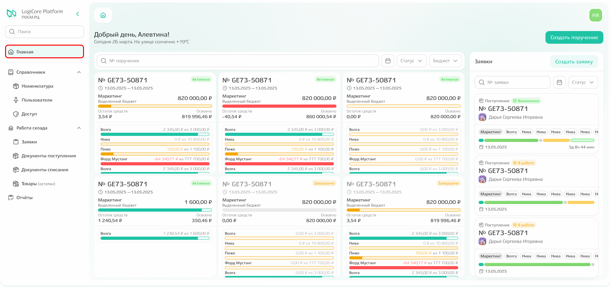

# Начало работы

## Вход в систему

Перед началом работы необходимо войти в систему: для этого введите электронную почту(1) и пароль(2), который получили ранее по почте для доступа в личный кабинет, и кликните по кнопке «Войти». 

{.center width=1200}



**Если вы впервые входите в систему, действуйте по следующему алгоритму:**

1. Обратитесь к пользователю с ролью администратор — он должен добавить вас в систему.
2. После добавления на вашу почту (ту, которую указал владелец бюджета) придёт письмо со ссылкой для активации.
3. Перейдите по ссылке — откроется окно, где необходимо придумать пароль для учётной записи.
4. Нажмите кнопку «Сохранить» — после этого вы перейдёте на страницу авторизации.
5. Для входа в систему:
    - в поле логин укажите ту же почту, на которую пришло письмо;
    - в поле пароль введите созданный вами пароль.



## Главная страница

После авторизации происходит **переход к главной или стартовой странице.** 

**Главная страница** — это ваша стартовая точка работы в системе. Она позволяет быстро переключаться между ключевыми подсистемами в меню, а также видеть актуальное состояние вашего бюджета и заявок.

{.center width=1200}

### Профиль

В правом верхнем углу располагается **иконка профиля** с вашими инициалами. 

{.center width=1200}

**Профиль** — это ваша личная учётная запись в системе. В нём содержатся все основные данные о вас как о пользователе: кто вы, к какому отделу и брендам относитесь, как с вами связаться. Эти данные используются для идентификации вас при создании заявок, назначении ответственных и в других рабочих процессах.

**Данные о себе можно просмотреть.** Для этого:
1. кликните по иконке с инициалами в правом верхнем углу;
2. в выпадающем меню выберите пункт «Профиль».

{.center width=1200}

После этого откроется **блок с информацией о вас,** где содержится информация о ФИО, электронной почте, номере телефона, должности, отделе и брендах, а также вашей активности — общем количестве созданных заявок по месяцам.

{.center width=1200}

Чтобы отредактировать ФИО, почту или номер телефона:
1. нажмите на иконку редактирования;
2. внесите нужные изменения;
3. сохраните их.

{.center width=1200}



**Изменить должность, отдел или бренды в профиле нельзя.**
Для корректировки этих данных обратитесь к своему руководителю, владельцу бюджета.



### Основная информация

**Визуально страницу можно разделить на 3 основные зоны:**
1. меню (слева);
2. рабочая область (центр);
3. область с информацией о заявках (справа).

{.center width=1200}

Из **меню** можно перейти к 
- справочнику
    - номенклатуры — содержит информацию о товарах, хранящихся на стоке: логистические фото, характеристики упаковки и другие параметры;
    - пользователей — содержит всех сотрудников, которые относятся к вашему отделу и бренду;
    - доступов — содержит все связи между вашим отделом, брендами и сотрудниками;
- списку заявок — все заявки, созданные в рамках ваших поручений;
- документам поступления — список закрывающих документов склада по заявкам на поступление;
- документам списания — список закрывающих документов склада по заявкам на списание;
- товарным остаткам — актуальные данные о наличии товаров на складе;
- отчётам — список ежедневных отчётов и биллингов. 

Взаимодействие с каждой из этих подсистем описано отдельно. Переходите к той части инструкции, которая описывает функционал, необходимый для вашей текущей задачи.



Подробная информация обо всех элементах главной страницы доступна **в разделе «Дополнительно».**

