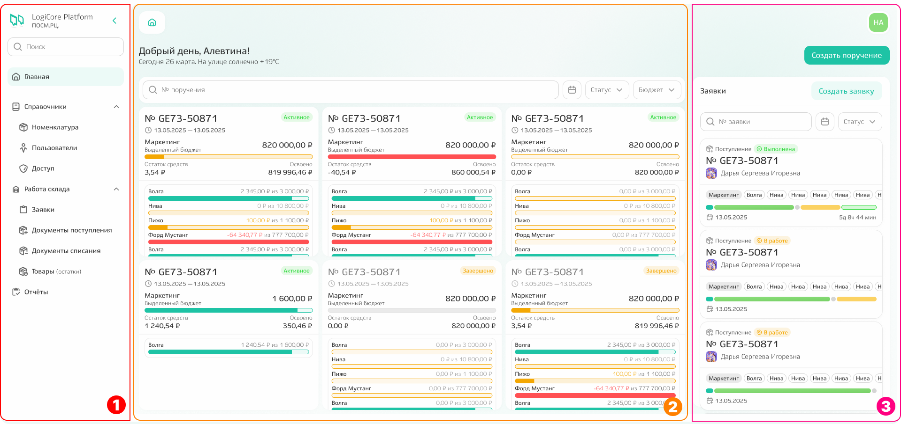
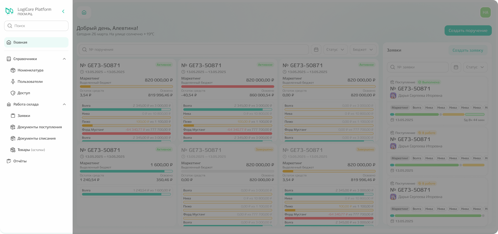
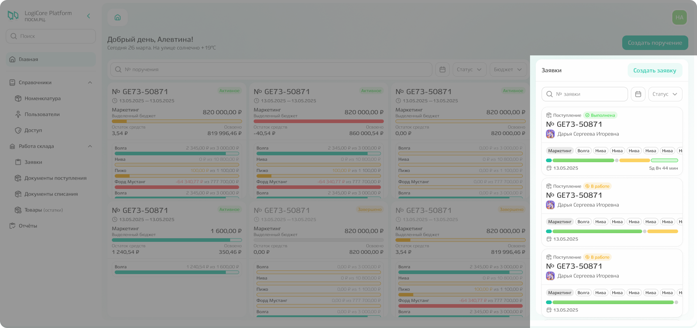
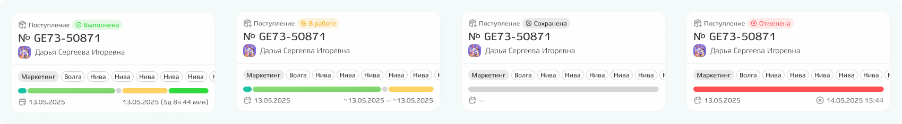
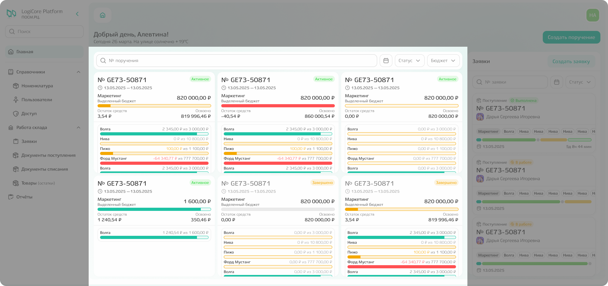
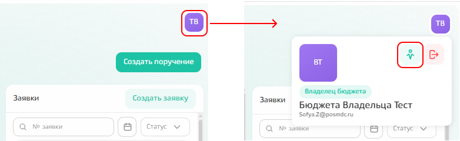
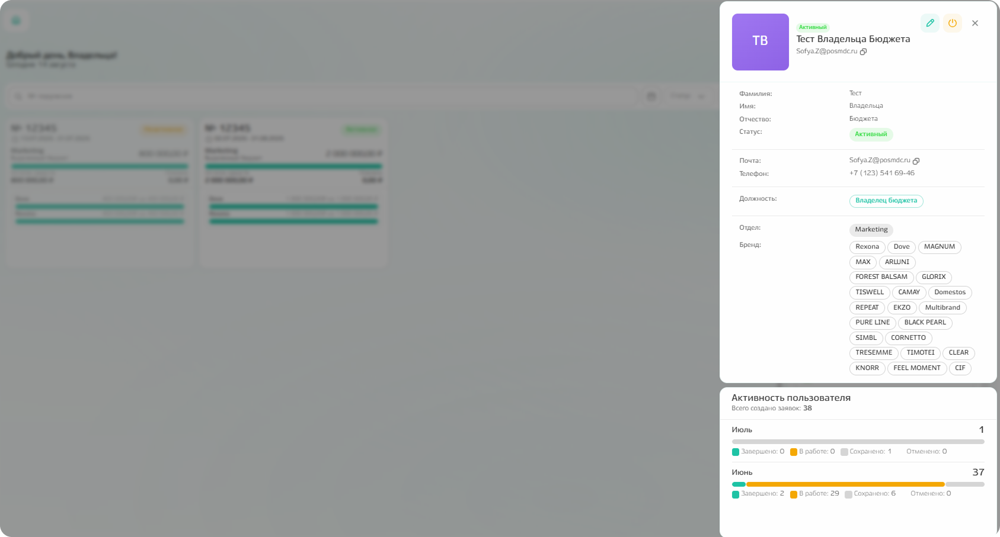
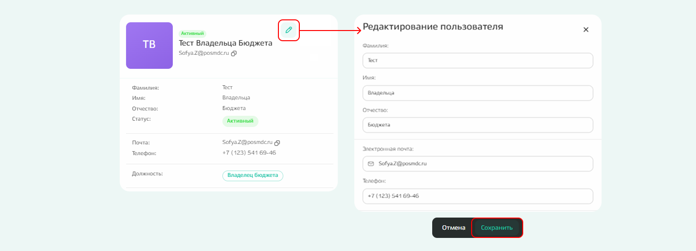

# Начало работы

## Вход в систему

Перед началом работы необходимо войти в систему: для этого введите электронную почту(1) и пароль(2), который получили ранее для доступа в личный кабинет, и кликните по кнопке «Войти». 

{.center width=1200}

## Главная страница

После авторизации происходит **переход к главной или стартовой странице.** 

Визуально страницу можно разделить на 3 части: меню(1), рабочая область(2) и область с дополнительной информацией(3).

{.center width=1200}

Из **меню слева** можно перейти к 
- справочнику
    - номенклатуры;
    - пользователей;
    - доступов
- списку заявок;
- документам поступления;
- документам списания;
- товарным остаткам;
- отчётам. 
Взаимодействие с данными подсистемами описано отдельно. 

{.center width=1200}

В виде карточек **справа располагается информация о заявках**: 1 карточка = 1 заявка.
Заявки привязаны к поручениям, с которыми вы работаете. Заявки вне ваших поручений увидеть не получится.  

{.center width=1200}

**В карточке задачи отражена информация о:** 
1. типе заявки (поступление/списание) и статусе заявки (выполнена/в работе/сохранена/отклонена);
2. номере заявки;
3. авторе заявки;
4. отделе и брендах;
5. этапе, на котором находится заявка - по наведению отобразится подсказка с названием этапа и планируемыми или фактическими датами начала и завершения работ;
6. планируемых или фактических датах старта и завершения работ по заявке.

{.center width=1200}

В зависимости от статуса заявки частично меняется информация, отображаемая в карточке заявки. 
Например, по заявке со статусом «Выполнена» отражается только фактически затраченное время по каждому из этапов и по всей заявке в общем, а для заявки в статусе «Сохранена» только время создания заявки и время отмены, даже если до этого уже были выполнены какие-то работы. 

{.center width=1200}

В **рабочей области располагается список поручений**, которые доступны для вас. Требуемое поручение можно найти с помощью поиска по номеру поручения, а также отфильтровать по статусу поручения или дате создания. 

{.center width=1200}

Информация по поручениям также распределена в виде карточек, где отображена информация о:
1. номере поручения;
2. сроке действия поручения; 
3. сумме бюджета, выделенного в рамках поручения на отдел;
4. остатке средств, доступных к расходованию в рамках заявки;
5. сумме уже израсходованных средств;
6. балансе освоенных и доступных к освоению средств в разбивке по брендам;
7. статусе поручения: активное/неактивное.

Также есть цветовая индикация для бюджетов:
- зеленый цвет - если средства израсходованы незначительно относительно выделенной суммы;  
- желтый цвет - бюджет израсходован больше, чем на 90%;
- красный цвет - бюджет полностью израсходован или имеет отрицательное значение.

{.center width=1200}

## Профиль

**Чтобы посмотреть или отредактировать данные о себе, необходимо перейти в профиль.** 
Для этого кликните по иконке в правом верхнем углу и выберите иконку профиля.

{.center width=1200}

После чего откроется [сайдбар](*key_sidebar) с информацией о ФИО, почте, контактном номере телефона, должности, принадлежности к отделу и брендам. Также можно посмотреть активность: общее количество созданных заявок по месяцам.  

{.center width=1200}

Если требуется внести информацию о ФИО, почте или контактном номере телефона, то кликните по иконке редактирования, а далее сохраните внесённые изменения.

{.center width=1200}



**Изменить информацию о должности, принадлежности к отделу или бренду нельзя.** 
Обратитесь к руководителю в случае, если требуется внести подобные изменения.



Далее при необходимости переходите к той части инструкции, которая описывает требуемый для выполнения работы функционал. 

[*key_sidebar]: Сайдбар — элемент интерфейса в виде колонки слева или справа, визуально отделённый от основного контента. Он предоставляет вспомогательную навигацию, инструменты или контекстную информацию, дополняя, но не прерывая работу пользователя с основной страницей