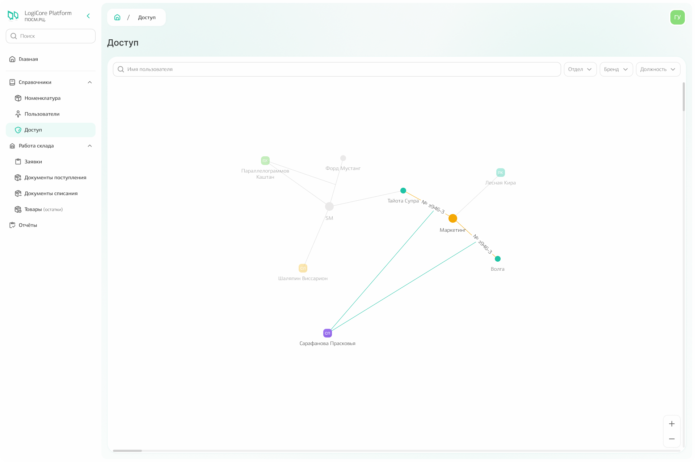
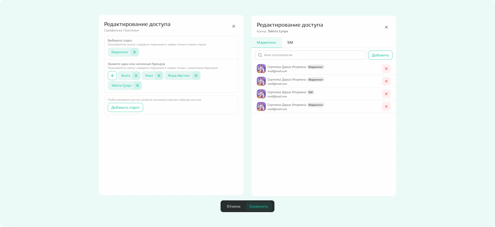

# Доступ

Подсистема «Доступ» содержит **граф связей**, на котором отображены связи между сотрудниками, брендами и отделами. 

## Как работает граф связей

**При наведении на любую вершину графа** подсвечиваются связи с другими вершинами.

**Связь между брендом и отделом обладает номером** — это номер поручения, по которому выделяется некоторая сумма в рамках бюджета отдела. 

**Если заключено несколько поручений** между одним и тем же отделом и брендом, в интерфейсе будет отображено несколько связей с разными номерами поручений.

Можно отфильтровать значения по отделу, по бренду или должности, а также найти конкретного пользователя по имени. 



На графе отображаются только те отделы, бренды и сотрудники, к которым у вас есть доступ. 



{.center width=1200}

## Редактирование

При клике на вершину появляется иконка редактирования — при нажатии на неё откроется модальное окно редактирования. 

**Если для редактирования был выбран пользователь,** то в модальном окне можно добавить, изменить или удалить отдел или бренд, но только в рамках тех, к которым у вас есть доступ. 

**Если для редактирования был выбран бренд,** то в модальном окне можно добавить или удалить пользователей в рамках отделов (переключаться между отделами можно с помощью вкладок).

{.center width=1200}

Чтобы закрыть окно, нажмите команду «х».

Чтобы увидеть, как будет выглядеть граф после внесённых изменений, нажмите команду «Сохранить».
