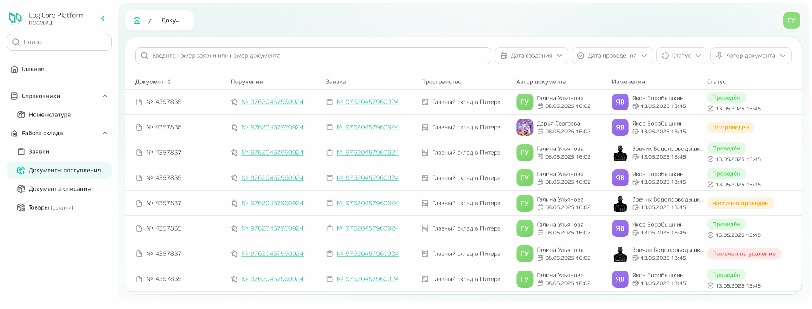
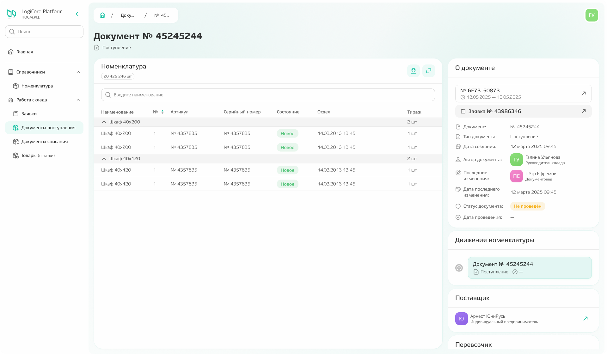
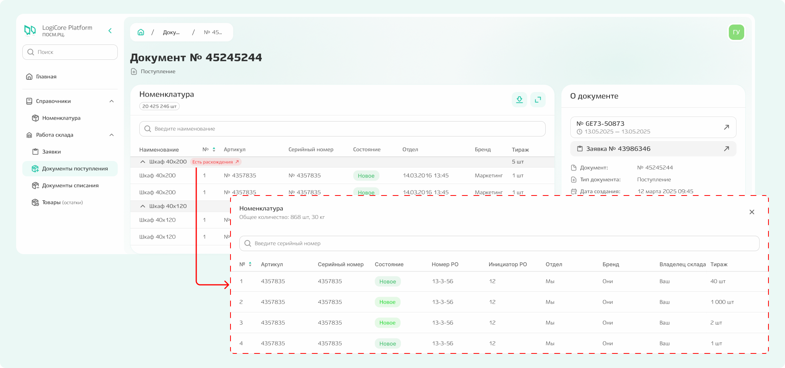
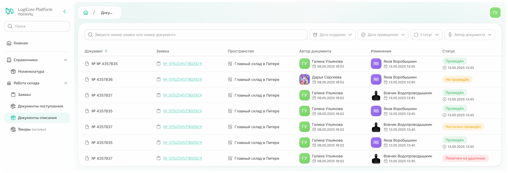
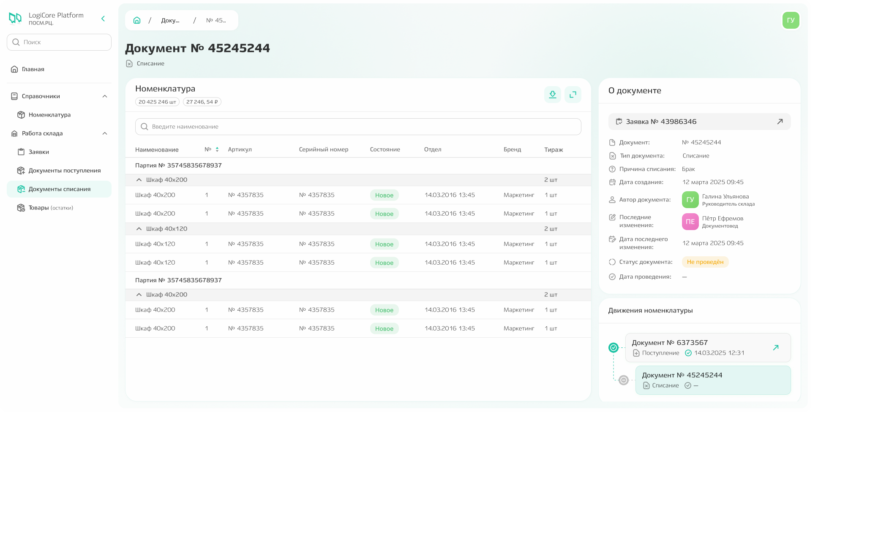

# Документы поступления

Подсистема содержит все документы, с помощью которых было оформлено поступление товара по заявкам.

{.center width=1200}

**При клике по конкретному документу можно увидеть** информацию о номенклатуре, движениях номенклатуры, общую информацию по документу, а также перейти к поручению и заявке, в рамках которых был сформирован документ. 

{.center width=1200}

**Если в рамках складских работ были зафиксированы расхождения,** информация об этом отобразится в интерфейсе. При клике по команде «Есть расхождения» будет открыто модальное окно с плановыми данными, тогда как в основной таблице будут отображены данные по фактической поставке. 

{.center width=1200}

# Документы списания 

Подсистема содержит все документы, с помощью которых было оформлено списание товара по заявкам.

{.center width=1200}

Функционал аналогичен подсистеме документов поступления: при клике по конкретному документу можно увидеть информацию о номенклатуре, движениях номенклатуры, общую информацию по документу, а также перейти к поручению и заявке, в рамках которых был сформирован документ. 

Просмотр информации о расхождениях реализован аналогично подсистеме документов поступления

{.center width=1200}
