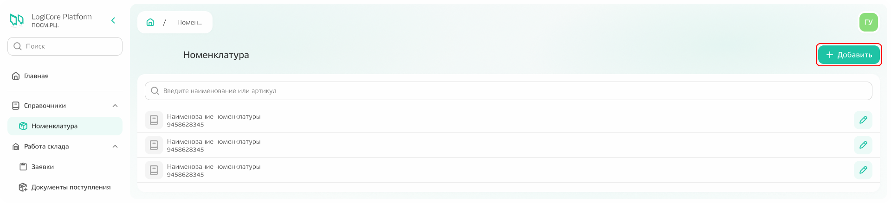
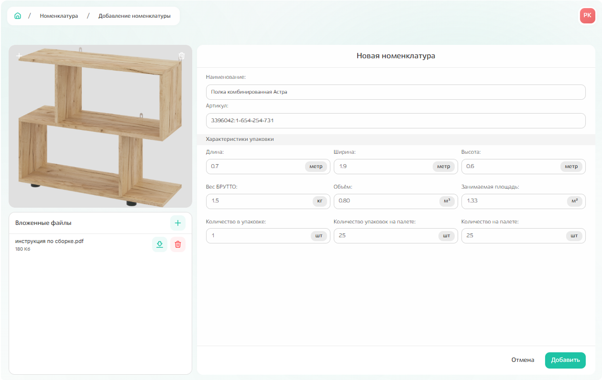

# Дополнительно

## Заявки на главной странице

В виде карточек **справа располагается информация о заявках**: 1 карточка = 1 заявка.
Заявки привязаны к поручениям, с которыми вы работаете. Заявки вне ваших поручений увидеть не получится.  

{.center width=1200}

**В карточке заявки отражена информация о:** 
1. типе заявки (поступление/списание) и статусе заявки (выполнена/в работе/сохранена/отклонена);
2. номере заявки;
3. авторе заявки;
4. отделе и брендах;
5. этапе, на котором находится заявка - по наведению отобразится подсказка с названием этапа и планируемыми или фактическими датами начала и завершения работ;
6. планируемых или фактических датах старта и завершения работ по заявке.

{.center width=1200}

В зависимости от статуса заявки частично меняется информация, отображаемая в карточке заявки. 
Например, по заявке со статусом «Выполнена» отражается только фактически затраченное время по каждому из этапов и по всей заявке в общем, а для заявки в статусе «Сохранена» только время создания заявки и время отмены, даже если до этого уже были выполнены какие-то работы. 

{.center width=1200}

## Поручения на главной странице

В **рабочей области располагается список поручений**, которые доступны для вас. Требуемое поручение можно найти с помощью поиска по номеру поручения, а также отфильтровать по статусу поручения или дате создания. 

{.center width=1200}

Информация по поручениям также распределена в виде карточек, где отображена информация о:
1. номере поручения;
2. сроке действия поручения; 
3. сумме бюджета, выделенного в рамках поручения на отдел;
4. остатке средств, доступных к расходованию в рамках заявки;
5. сумме уже израсходованных средств;
6. балансе освоенных и доступных к освоению средств в разбивке по брендам;
7. статусе поручения: активное/неактивное.

Также есть цветовая индикация для бюджетов:
- зеленый цвет - если средства израсходованы незначительно относительно выделенной суммы;  
- желтый цвет - бюджет израсходован больше, чем на 90%;
- красный цвет - бюджет полностью израсходован или имеет отрицательное значение.

{.center width=1200}

## Добавление номенклатуры из справочника

Номенклатура добавляется по команде «Добавить», расположенной над списком номенклатуры.

{.center width=1200}

**У любой номенклатуры необходимо заполнить обязательные поля**: наименование и артикул. 

Рекомендуется заполнить поля с информацией о характеристиках упаковки, в которой поставляется номенклатура, поле страховой стоимости, а также прикрепить фото номенклатуры и связанные с ней файлы. 

После заполнения всех полей нажмите кнопку «Добавить».

{.center width=1200}