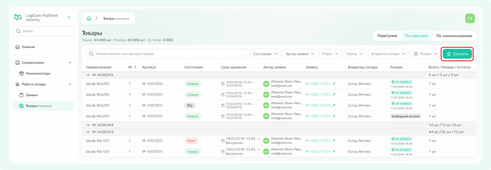

# Товары

В подсистеме «Товары» отражены складские остатки по тем отделам и брендам, с которыми вы работаете.  

{.center width=1200}

По каждому товару в списке доступна следующая информация:
- наименование;
- артикул;
- состояние;
- срок хранения;
- автор заявки — сотрудник, создавший заявку, по которой товар поступил на склад;
- номер заявки — при клике по нему осуществляется переход к соответствующей заявке;
- резерв — указано, зарезервирован ли остаток для какой-либо заявки/заказа или хранится свободно («свободный остаток»);
- резерв/остаток — количество товара на складе с разбивкой на свободный и зарезервированный объём.



**Некоторые строки в списке могут быть выделены красным** — это значит, что товар хранится на складе после указанных в заявке дат хранения.



**Для быстрого поиска** конкретного товара используйте:
- поисковую строку — введите наименование или артикул;
- фильтры — для сортировки списка по различным критериям.

Все фильтры равнозначны и могут применяться как по отдельности, так и в комбинации друг с другом.

При клике по строке с товаром открывается карточка с полной информацией о нём, включая все ранее внесённые данные.

{.center width=1200}

Все остатки можно выгрузить в Excel-файл — нажмите кнопку «Скачать».

{.center width=1200}