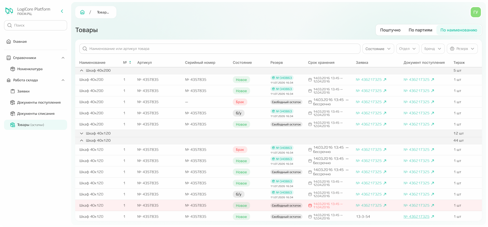
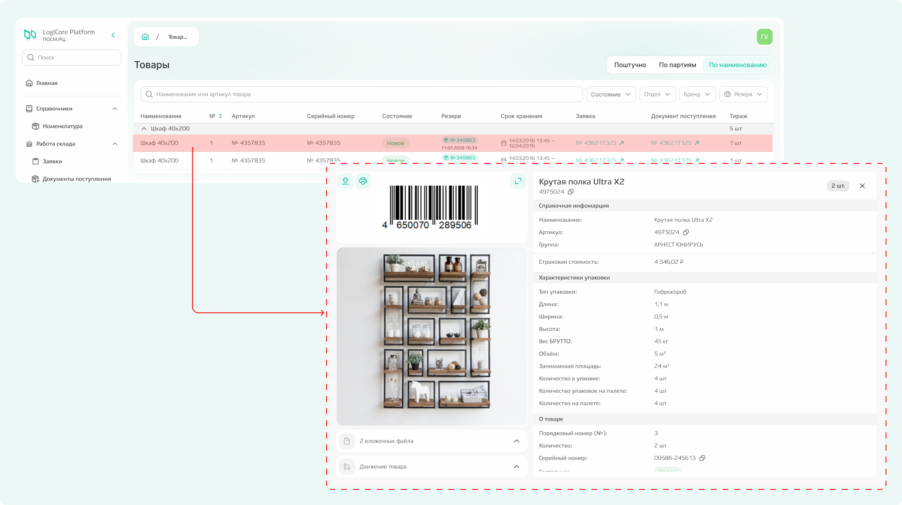
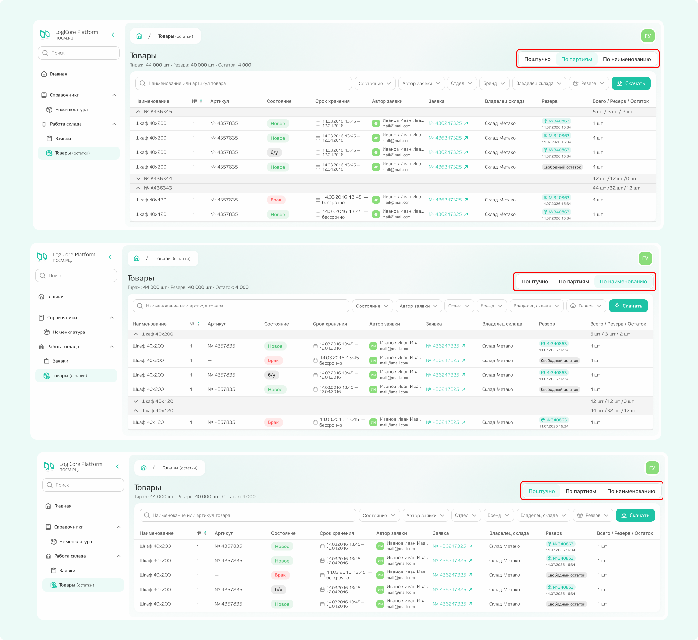

# Товары

В подсистеме «Товары» отражены складские остатки по тем отделам и брендам, с которыми вы работаете.  

{.center width=1200}

По каждому товару помимо наименования, артикула, серийного номера и состояния можно посмотреть информацию о:
- резерве — зарезервирован ли товарный остаток для какой-то заявки/заказа или хранится без резерва («свободный остаток»);
- сроке хранения;
- номере заявки — при клике по номеру происходит переход к заявке, в рамках которой было поступление товара;
- номере документа поступления — при клике по номеру также происходит переход к просмотру информации о документе, на основании которого товар учтён на складе; 
- тираже — какое количество товара сейчас хранится на складе. 



**Некоторые строки в списке могут быть выделены красным** — это значит, что товар хранится на складе после указанных в заявке дат хранения.



Можно найти конкретный товар по наименованию или артикулу с помощью поиска или воспользоваться фильтрами для сортировки информации. Все фильтры на странице равнозначны и могут применяться как по отдельности, так и в комбинации друг с другом.

При клике по строке открывается карточка товара со всей ранее указанной информацией.

{.center width=1200}

Также можно настроить группировку товарных остатков по партиям, по наименованию и поштучно, в результате группировка в списке изменится. Чтобы выполнить эту настройку, необходимо выбрать соответствующий вариант группировки в правом верхнем углу. 

{.center width=1200}