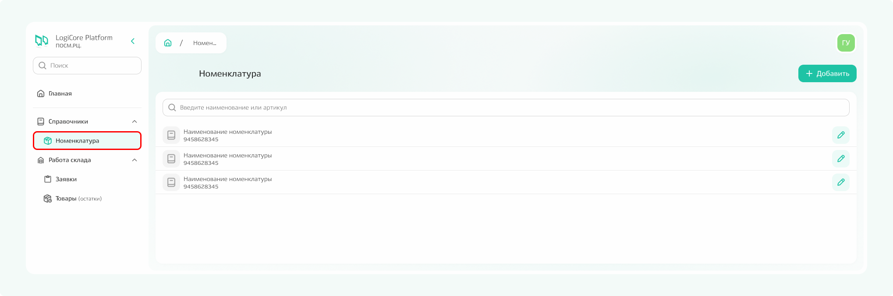
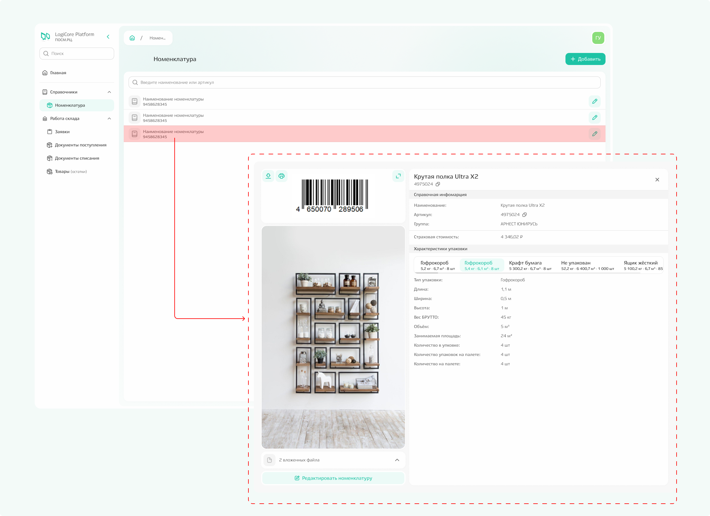
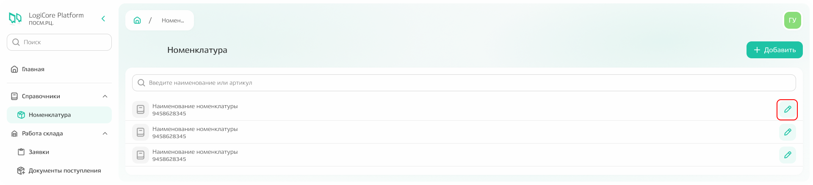
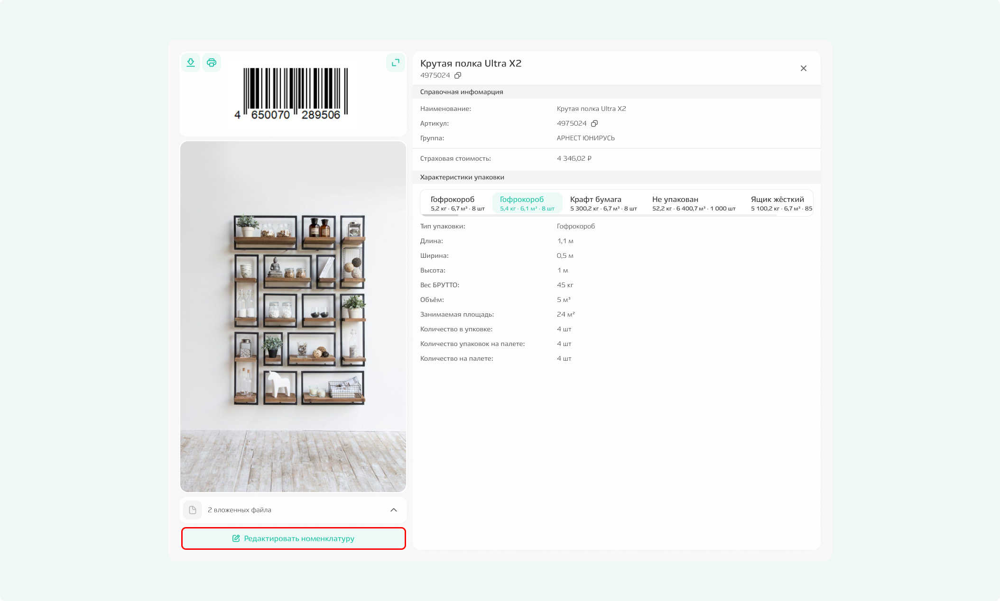
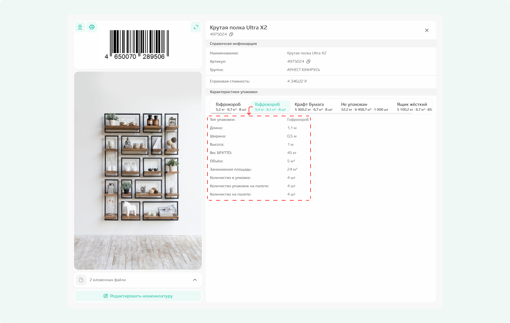

# Справочник «Номенклатура»

**Подсистема содержит информацию о всех товарах, когда-либо добавленных в систему.** Здесь хранятся данные даже о тех позициях, которых уже нет на складе или которые только планируются к поступлению: логистические фото, габариты, характеристики упаковки и другие справочные сведения.

Чтобы перейти к списку номенклатуры, выберите пункт «Номенклатура» в боковом меню.

{.center width=1200}

## Просмотр информации о номенклатуре

При переходе в подсистему открывается **список всех ранее добавленных товаров.** Чтобы увидеть подробную информацию по конкретной позиции, кликните по её названию в списке.

{.center width=1200}

В карточке номенклатуры содержится:
- **справочная информация** — наименование и артикул;
- **характеристики упаковки** — данные о том, в какой упаковке товар был поставлен;
- **фото и вложенные файлы** (опционально, могут отсутствовать).

**Как заполняется карточка:**
1. **Справочная информация** (наименование и артикул) добавляется вами при создании номенклатуры. Это можно сделать заранее или в момент формирования заявки.
*Подробнее о создании заявок написано в отдельном разделе.*
2. **Характеристики упаковки** появляются после приёмки товара на склад — это фактическая информация об упаковке поставки. Вы также можете указать их самостоятельно при создании или редактировании номенклатуры, если заранее знаете, в какой упаковке обычно поступает товар. Это помогает складу эффективнее планировать работу.
3. Фото и файлы можно прикрепить вручную при создании или редактировании карточки.

## Редактирование и удаление информации о номенклатуре

Если при просмотре карточки вам понадобилось изменить справочные данные, добавить или скорректировать информацию об упаковке, загрузить новые фото — воспользуйтесь режимом редактирования.

**Чтобы отредактировать номенклатуру:** 
- кликните по иконке редактирования (карандаш) напротив нужной позиции в общем списке; 

{.center width=1200}

- или откройте карточку товара и нажмите кнопку редактирования внутри неё.

{.center width=1200}

В открывшемся модальном окне вы **можете изменить любое поле.** Чтобы добавить ещё один вариант упаковки, нажмите кнопку «Новая конфигурация».

{.center width=1200}

Если создано несколько конфигураций упаковки, в модальном окне появляются вкладки — при переключении между ними отображаются соответствующие характеристики. 

{.center width=1200}



**Удалить номенклатуру нельзя** — можно только отредактировать уже внесённую информацию. 



**Вы также можете добавить номенклатуру заранее, до создания заявки.** Алгоритм описан в разделе «Дополнительно».