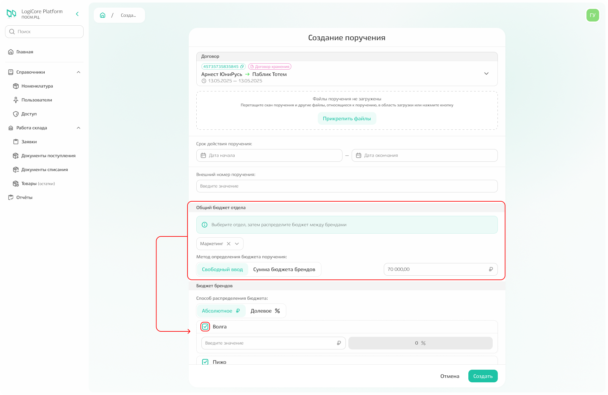
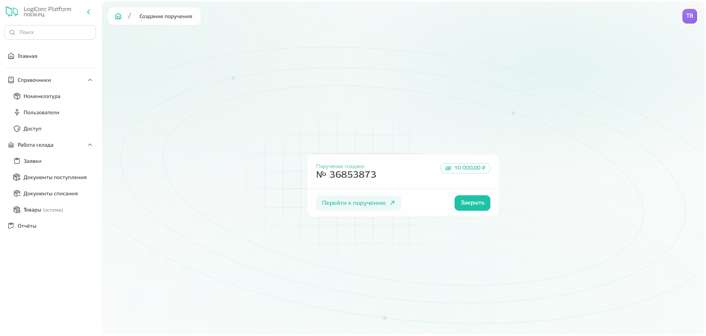
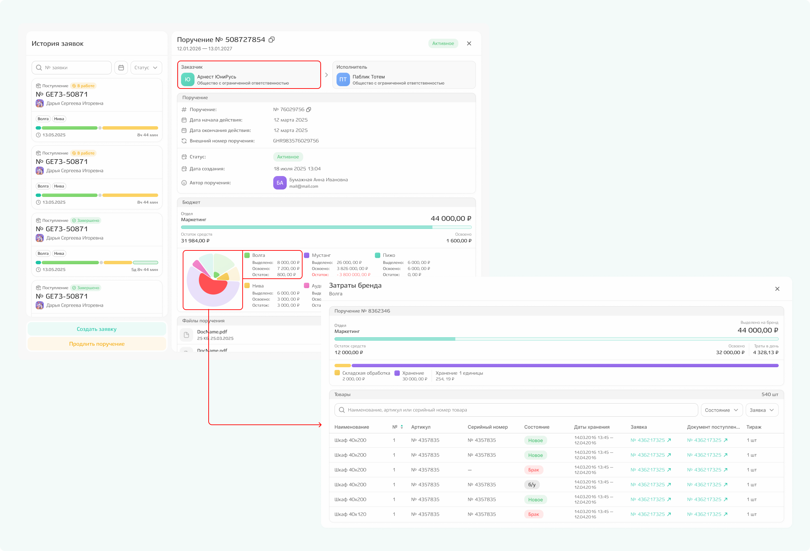
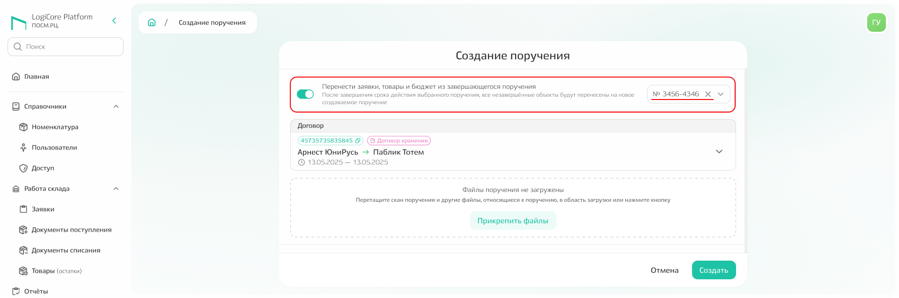
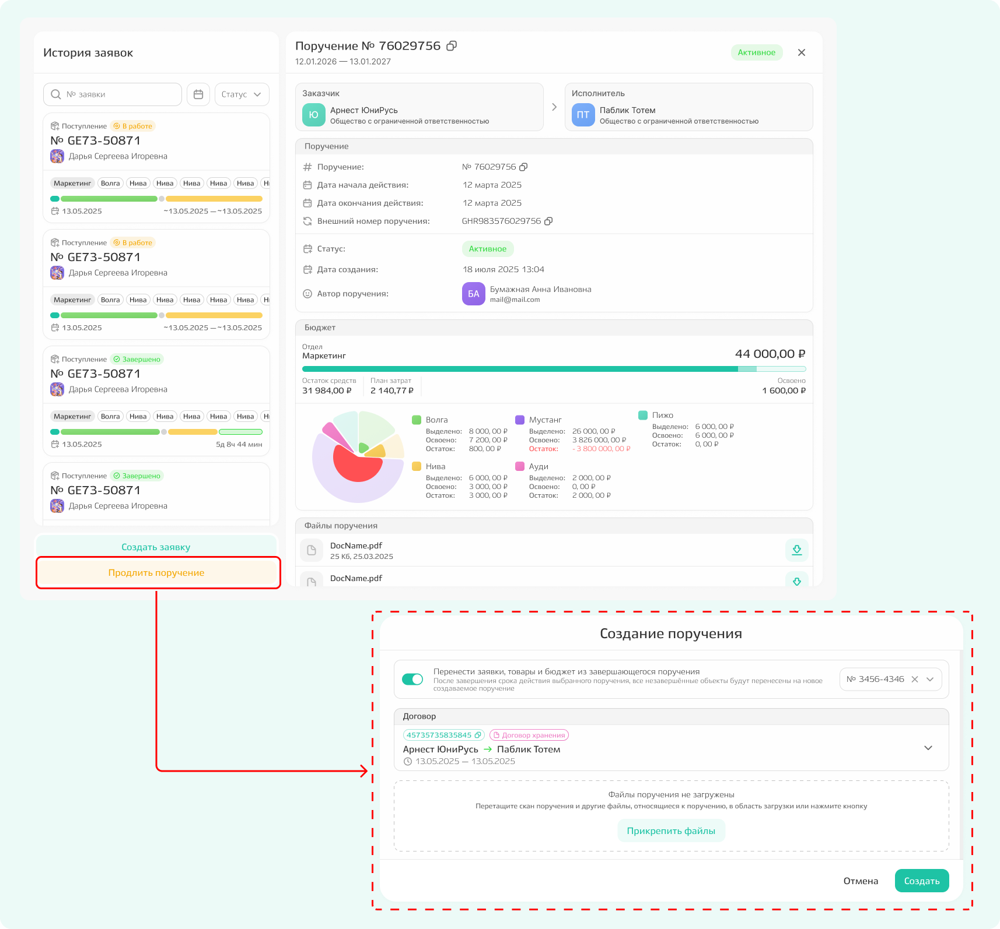

# Поручение

Просмотр поручений, а также их добавление возможно только с главной страницы. Подробное описание отображения и разбивки по карточкам приведено в разделе [«Главная страница»](./about.md).

## Создание поручения
С главной страницы нажмите «Создать поручение». Откроется модальное окно, в котором необходимо указать:
- срок действия поручения;
- внешний номер поручения (при наличии);
- бюджет — общий и в разбивке по брендам, 
а также прикрепить скан поручения в области загрузки файлов. 

При распределении бюджета можно убрать ненужные бренды из поручения: снимите галочку рядом с названием бренда. После удаления появится сообщение, что в заявках, созданных на основании данного поручения, нельзя будет использовать номенклатуру, относящуюся к данному бренду.

{.center width=1200}

Нажмите «Создать» — откроется модальное окно с номером созданного поручения, откуда можно перейти к просмотру поручения(«Перейти к поручению») ил на главную страницу(«Закрыть»).  

{.center width=1200}

## Просмотр информации о поручении

**Нажмите на существующее поручение** — откроется модальное окно с подробной информацией, где можно будет посмотреть информацию о:
- заказчике;
- исполнителе;
- поручении;
- истории заявок - список всех заявок, созданных в рамках поручения;
- соотношении потраченных и неизрасходованных средств по бюджету. 

При просмотре информации **можно сразу же создать заявку.** Подробнее о создании заявки можно прочитать в соответствующем разделе [инструкции](./tasks_bud_owner.md).

**Чтобы посмотреть детализацию трат по конкретному бренду** в рамках поручения, кликните по диаграмме или наименовании конкретного бренда. Яркие цвета означают нерастраченный остаток, менее насыщенные — потраченный бюджет.

{.center width=1200}

## Продление поручения

В системе существует 2 варианта для продления поручений.

### Вариант № 1 

При создании нового поручения необходимо включить флажок переноса, как показано на скриншоте ниже, и выбрать из списка номер того поручения, чей срок истекает. Дальнейшие шаги аналогичны с созданием поручения. 
**Все товарные остатки, заявки и бюджеты из этого поручения будут перенесены на новое.**

{.center width=1200}



**Если сумма завершающегося поручения была или будет в минусе,** то при создании поручения, на которое переносятся остатки, нельзя ввести бюджет меньше той суммы, что ушла в минус. 



### Вариант № 2

Продлить поручение можно при просмотре информации о поручении по кнопке «Продлить поручение»: после этого также произойдёт переход к экрану создания поручения, как и в варианте 1. Однако, флажок переноса поручения уже будет включен, а номер поручения предвыбран в выпадающем списке. 

{.center width=1200}