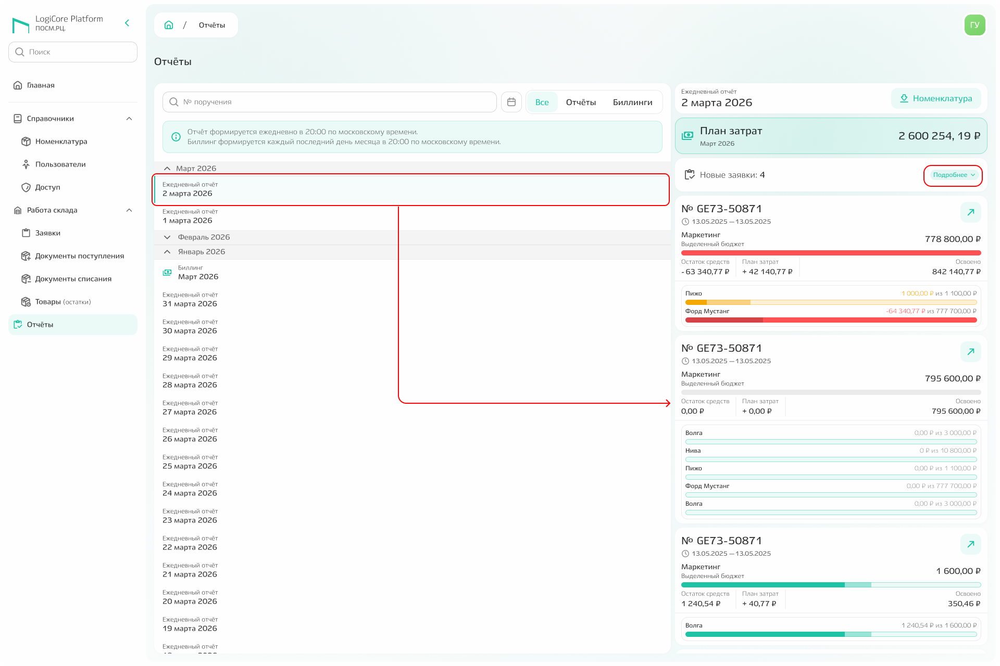
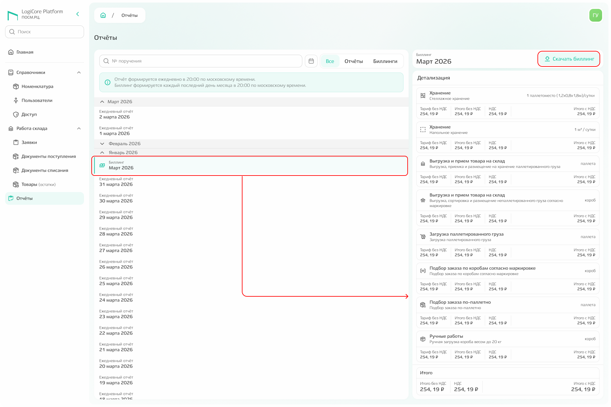

# Отчёты

В подсистеме «Отчёты» **собраны ежедневные отчёты и биллинги** (отчёты за месяц). По умолчанию в списке отображается последний сформированный отчёт. В сайдбаре справа показана информация о плановых затратах, созданных поручениях и заявках.

Нажмите команду «Подробнее» — откроется список заявок, откуда можно перейти к модальному окну с подробной информацией по конкретной заявке.

{.center width=1200}

При выборе биллинга информация в сайдбаре меняется и показывает основные данные. Кроме того, **биллинг можно скачать в формате PDF** — для этого нажмите команду «Скачать биллинг». 

{.center width=1200}