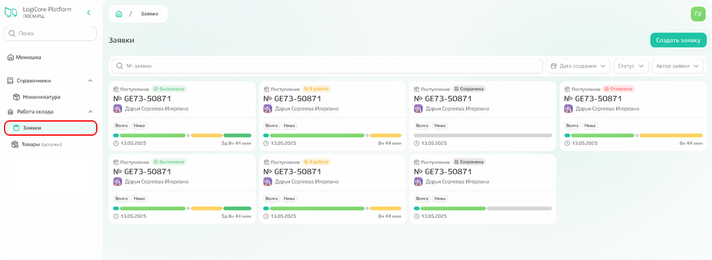
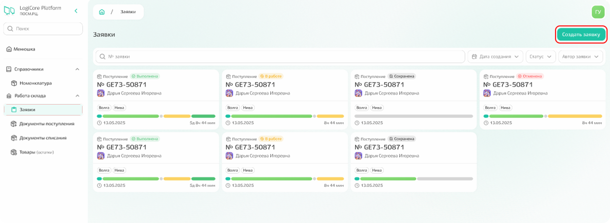
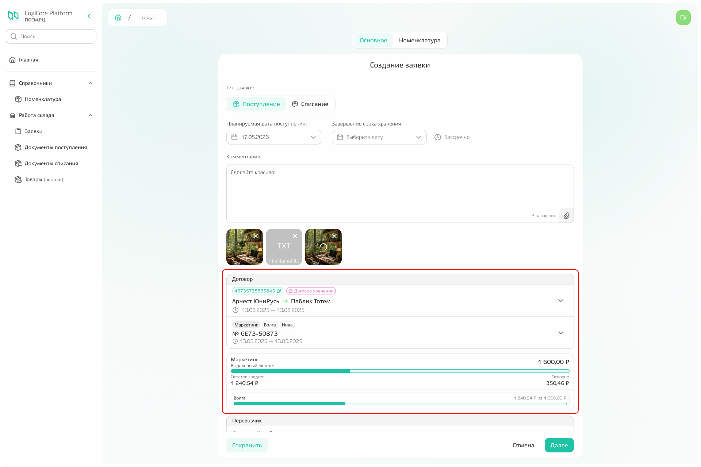
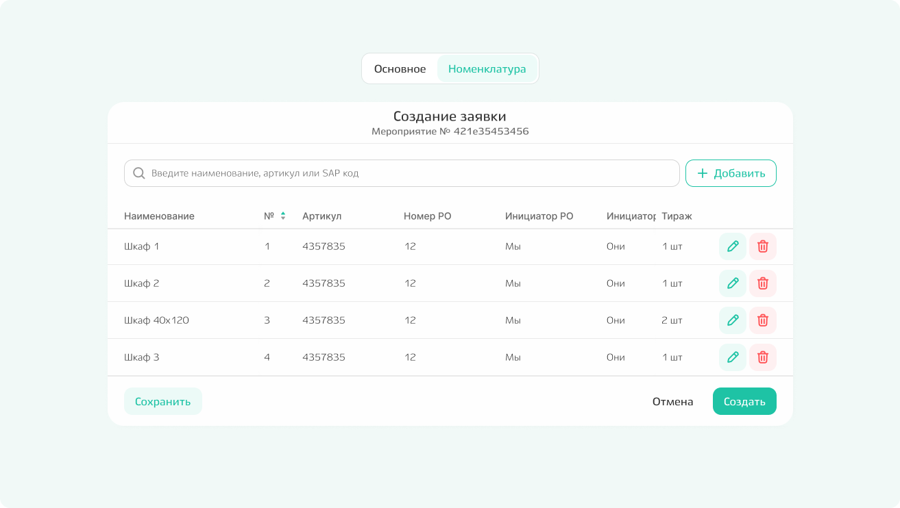
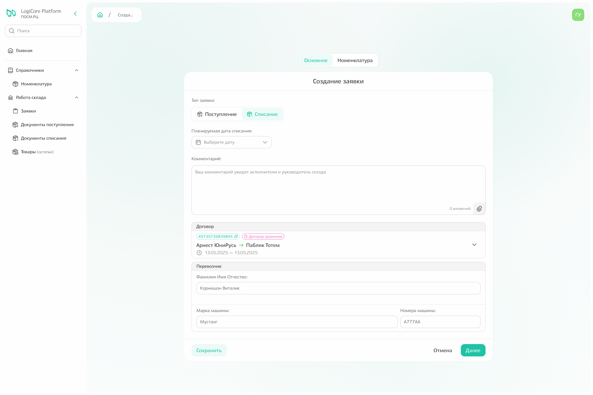
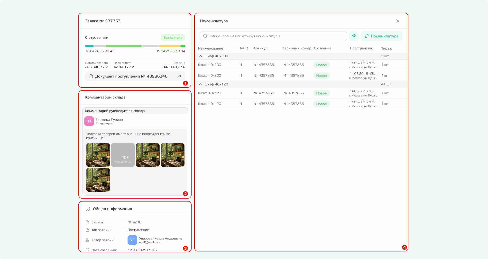
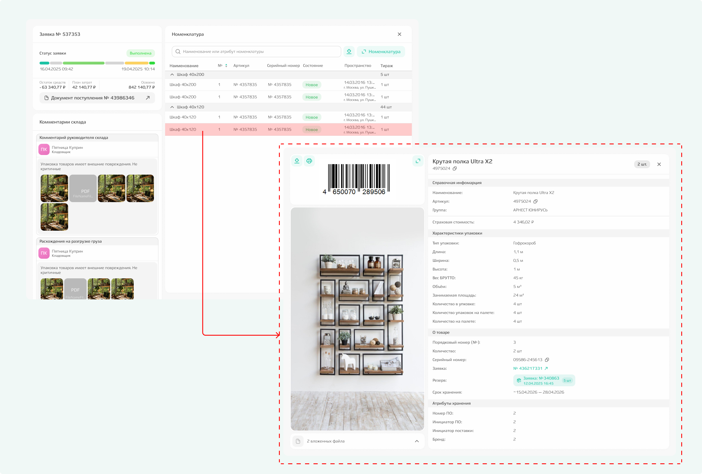
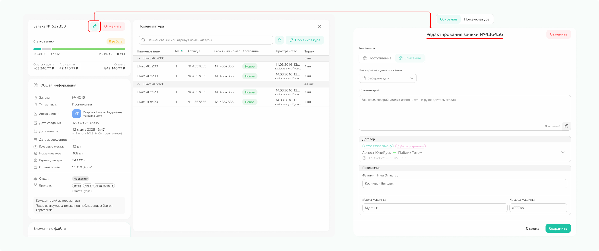

# Заявки

Подсистема «Заявки» содержит **список всех заявок в рамках ваших поручений**.  
По составу он аналогичен списку на главной странице, но функциональность здесь шире: доступны дополнительные действия и фильтры.

{.center width=1200}

## Создание заявки

**Чтобы создать новую заявку**, нажмите кнопку «Создать заявку».

{.center width=1200}



**Заявки и на поступление, и на списание создаются в одном месте** — через кнопку «Создать заявку». Тип заявки выбирается в модальном окне при заполнении формы. 



После нажатия «Создать» откроется форма, в которой необходимо:
- выбрать тип заявки (поступление или списание);
- заполнить поля в соответствии с выбранным типом.

### Поступление

**На вкладке «Основное» указываются**
- тип заявки: поступление,
- планируемая дата поставки и планируемое завершение срока хранения,
- комментарий: виден для исполнителей, при необходимости можно прикрепить файлы для конкретизации, 
- договор и поручение, в рамках которых выполняется работа по заявке.

{.center width=1200}

**После выбора поручения появляется список брендов**, которые включены в поручение, а также сумма выделенная для работ по конкретному бренду. 

{.center width=1200}

**Рекомендуется при наличии информации заполнить поле «Перевозчик»:** ФИО перевозчика, марку и номера машины. 

**На вкладке «Номенклатура»** введите в поиске наименование, артикул или SAP-код. 
Если номенклатура была обнаружена, то кликните по значению в выпадающем списке, а в открывшемся модальном окне укажите тираж (количество поступающей номенклатуры) и, по возможности, укажите характеристики упаковки, в которой планируется поставка номенклатуры. 
*Если номенклатура не нашлась, то по команде «Добавить» можно создать новую номенклатуру. После внесения необходимой информации номенклатура будет добавлена не только в заявку, но и в справочник «Номенклатуры».*

После внесения всей информации сохраните выбранную номенклатуру в заявку.  
   
{.center width=1200}

Когда вся номенклатура добавлена, нажмите команду «Создать».

{.center width=1200}



В интерфейсе также есть команда **«Сохранить»**. При клике по ней заявка сохраняется, но не запускается в работу. К ней можно вернуться позже из списка заявок и продолжить заполнение. 



### Списание

**На вкладке «Основное» указываются**
- тип заявки: списание,
- планируемая дата списания,
- комментарий: виден для исполнителей, при необходимости можно прикрепить файлы для конкретизации, 
- договор, в рамках которого выполняется работа по заявке.

**При наличии информации также заполняется поле «Перевозчик»:** ФИО перевозчика, марку и номера машины.

{.center width=1200}

**На вкладке «Номенклатура»** введите в поиске наименование, артикул или SAP-код необходимой номенклатуры. Если номенклатура была обнаружена, то кликнете по значению в выпадающем списке, а в открывшемся модальном окне укажите количество номенклатуры, которое будет списано. После заполнения добавьте номенклатуру в заявку по команде «Сохранить».  
   
{.center width=1200}

Когда вся номенклатура добавлена, нажмите команду «Создать».

{.center width=1200}



В интерфейсе также есть команда **«Сохранить»**. При клике по ней заявка сохраняется, но не запускается в работу. К ней можно вернуться позже из списка заявок и продолжить заполнение. 



## Просмотр заявки

После того, как заявка была создана, статус работ по заявке можно отследить в общем списке. На странице **можно найти ранее созданную заявку** и посмотреть подробную информацию в модальном окне, открывающемуся по клику на конкретной карточке заявки.  

{.center width=1200}

В окне содержится информация о:
1. **статусе заявки:** 
    1. «Выполнена» означает, что все работы завершены;
        При статусе «Выполнена» отображается документ поступления или списания, по которому можно кликнуть и перейти к просмотру в другом модальном окне.
    2. «В работе» — заявка отправлена на склад, работы ещё не закончены;
    3. «Сохранена» — это черновик, заявка ещё не отправлена;
    4. «Отменена» — работы не были выполнены.
2. **комментариях склада**: данный блок отображается, если при выполнении каких-либо работ на складе возникли проблемы или расхождения, которые были зафиксированы руководителем склада или другим исполнителем;
3. **общей информации**: блок с теми сведениями, которые указывались при создании заявки;
4. **номенклатуре**: список той номенклатуры, которая была поставлена или списана в ходе складских работ по текущей заявке.
    При клике по конкретному значению открывается модальное окно с информацией по выбранной номенклатуре. 

{.center width=1200}

## Редактирование заявки

Если необходимо внести дополнительные сведения или изменить информацию, то заявку можно отредактировать в случае:
- если заявка находится **в статусе «Сохранено»** → для редактирования доступно любое поле;
- если заявка создана, но разгрузка (поступления) или отгрузка (списание) на складе еще не начались → для редактирования доступна информация о перевозчике, корректировка дат и изменение комментария.
**В любых других случаях редактирование недоступно.**

Для редактирования кликните в списке по той заявке, которую требуется изменить, и найдите иконку редактирования. 

{.center width=1200}

## Отмена заявки

**Заявку можно отменить, если** она имеет статус «В работе»: для отмены заявки кликните по нужной заявке в списке и нажмите команду «Отменить». 

**Заявку можно удалить, если** она имеет статус «Сохранена»: для удаления заявки кликните по нужной заявке в списке и нажмите команду «Удалить». 

{.center width=1200}
