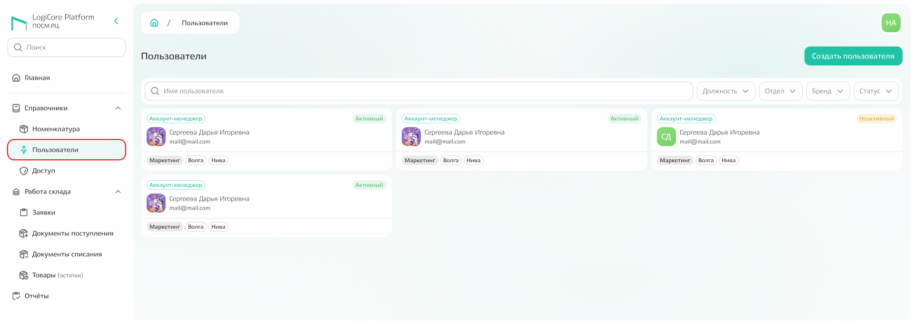
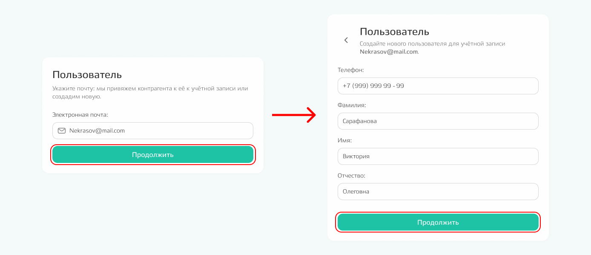
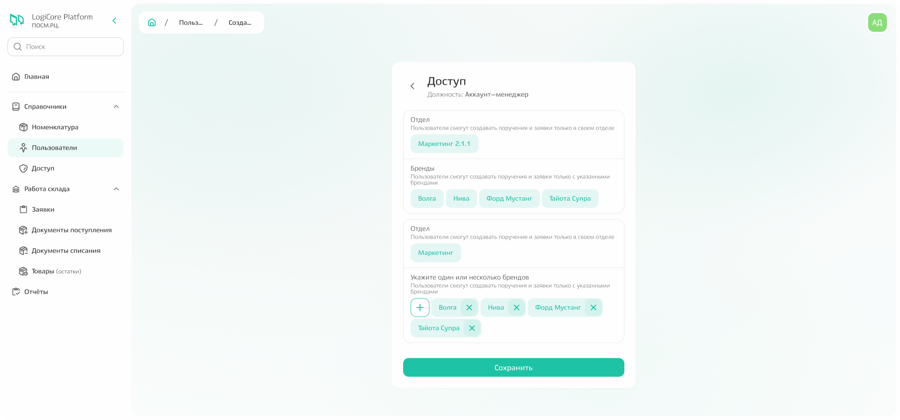
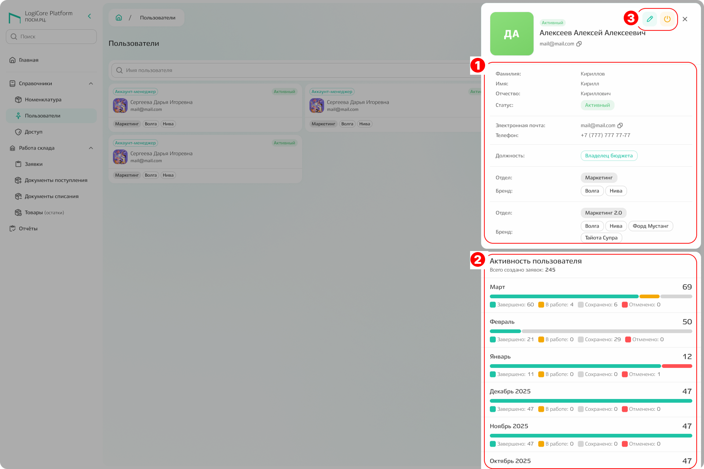
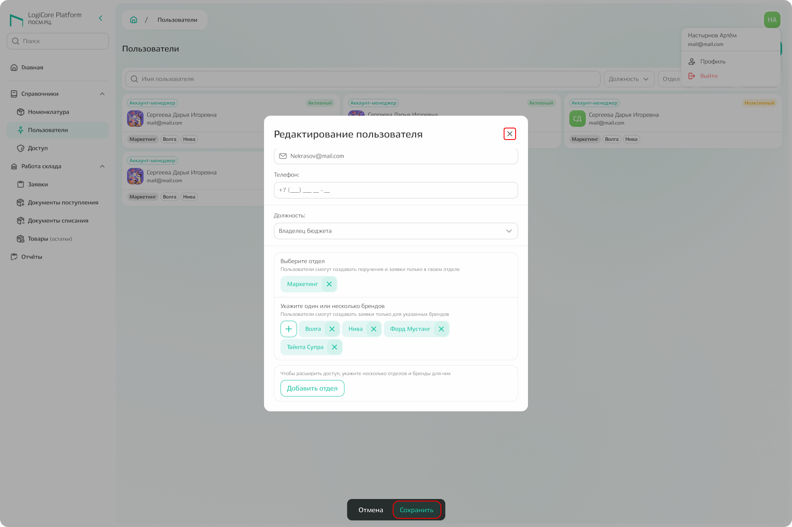
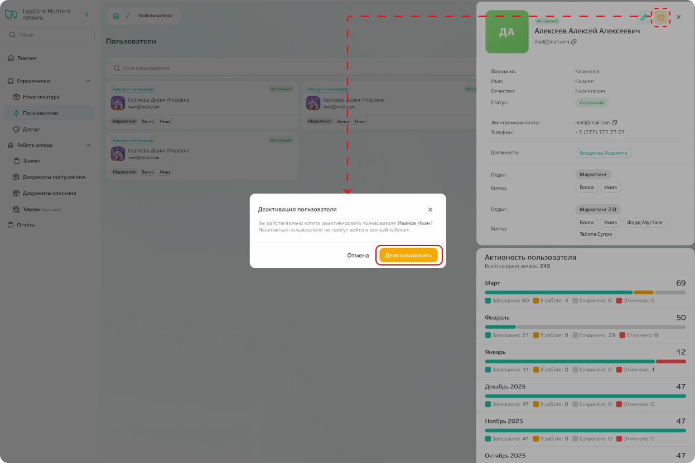

# Пользователи

Для перехода к подсистеме «Пользователи» необходимо кликнуть по одноименной подсистеме в боковом меню. Откроется страница со списком карточек всех пользователей, добавленных в систему. 

{.center width=1200}

## Добавление нового пользователя

Нажмите «Создать пользователя» — откроется модальное окно. 
Заполните электронную почту и нажмите «Продолжить» для перехода к заполнению основных данных: ФИО и телефон.

{.center width=1200}

После заполнения основных данных вновь нажмите «Продолжить», чтобы выбрать уровень доступа в системе (роль пользователя).



**Как владелец бюджета вы можете создать только аккаунт-менеджера.**
При необходимости добавления пользователей с другой ролью, обратитесь к администратору. 



Для аккаунт-менеджера можно выбрать один или несколько брендов по одному или нескольким отделам и далее нажмите кнопку «Сохранить».

{.center width=1200}

## Просмотр информации о пользователе

Чтобы открыть информацию о пользователе, кликните по его карточке в списке. 

При клике откроется сайдбар с информацией:
1. основные данные (ФИО, статус, телефон, email, должность, отдел, бренд);
2. активность пользователя за всё время в системе;
3. иконки для редактирования и деактивации пользователя.

{.center width=1200}

## Редактирование информации о пользователе

Нажмите на иконку редактирования в сайдбаре — откроется модальное окно с полями для редактирования:
- «×»(закрыть) — закрыть окно без сохранения;
- «Сохранить» — применить изменения. 

В интерфейсе появится уведомление об успешном сохранении.



**Состав брендов и отделов можно изменить только для аккаунт-менеджеров.** 
Изменить роль пользователя либо добавить отделы и бренды за пределами своих полномочий нельзя. 



{.center width=1200}

## Деактивация пользователя

**Деактивация — аналог удаления в системе.** Пользователя нельзя удалить полностью, можно только сделать неактивным:
1. Нажмите на иконку деактивации;
2. Подтвердите действие в модальном окне.



**После деактивации** пользователь не сможет войти в систему.



{.center width=1200}

Для активации пользователя снова нажмите ту же иконку.